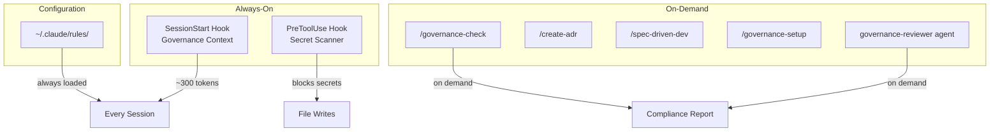

# claude-governance

**Governance framework for Claude Code** — fitness functions, secret scanning, spec-driven development, and architectural decision records.

> Stop writing code. Start governing AI that writes code for you.

---

## Quick Start

```bash
# 1. Add marketplace
claude plugin marketplace add pitimon/claude-governance

# 2. Install plugin
claude plugin install claude-governance@claude-governance

# 3. (Optional) Install rules to ~/.claude/rules/
bash ~/.claude/plugins/marketplaces/claude-governance/scripts/install-rules.sh
```

Start a new session — governance context loads automatically.

---

## What You Get

### Always-On (Hooks)

| Hook | Event | What It Does |
|------|-------|--------------|
| Governance context | `SessionStart` | Injects Three Loops model + fitness functions (~300 tokens) |
| Secret scanner | `PreToolUse` | Blocks `Edit`/`Write` containing hardcoded secrets (exit 2 = block) |

**Detected secret patterns:** `sk-*`, `ghp_*`, `gho_*`, `ghs_*`, `AKIA*`, `xox[bpsar]-*`, `API_KEY=`, `password=`

### On-Demand (Commands, Skills, Agent)

| Component | Usage | Purpose |
|-----------|-------|---------|
| `/governance-check` | `/governance-check pre-commit` | Run fitness functions against staged changes |
| `/create-adr` | `/create-adr "Title"` | Generate Architecture Decision Record |
| `/spec-driven-dev` | `/spec-driven-dev` | Spec-first development: define WHAT, AI implements HOW |
| `/governance-setup` | `/governance-setup` | Initialize governance in any project |
| `governance-reviewer` | Auto-triggered | Agent for compliance review of code changes |

### Rules (Optional)

5 ready-to-use rules for `~/.claude/rules/`:

| Rule | Focus |
|------|-------|
| `governance.md` | Fitness functions at every stage |
| `coding-style.md` | Immutability, file size, error handling |
| `git-workflow.md` | Conventional commits, PR workflow |
| `testing.md` | TDD, 80% coverage minimum |
| `security.md` | No secrets, input validation, OWASP |

```bash
# Install all rules (backs up existing files)
bash ~/.claude/plugins/marketplaces/claude-governance/scripts/install-rules.sh

# Governance rule only
bash ~/.claude/plugins/marketplaces/claude-governance/scripts/install-rules.sh --governance-only
```

---

## Core Concepts

### Three Loops Decision Model

Classify every task by AI autonomy level:

```
Out-of-Loop     AI executes, human reviews after
                Formatting, lint, imports, simple bug fixes

On-the-Loop     AI proposes, human approves
                Features, API changes, refactoring > 3 files

In-the-Loop     Human decides, AI assists
                Architecture, security, breaking changes, data migration
```

### Fitness Functions

Automated governance checks — "unit tests for architecture":

```
Pre-Commit      No secrets, input validation, parameterized queries,
                file < 800 lines, functions < 50 lines, immutability

Pre-PR          Conventional commits, DOMAIN.md updated, test coverage >= 80%

Architecture    Service boundaries, error message safety, auth coverage,
                rate limiting on public endpoints
```

### Spec-Driven Development

```
Understand ──> Specify ──> Plan ──> Implement ──> Verify
    │              │          │          │            │
    │              │          │          │            │
 Explore       Write      Plan Mode  Code to     Check criteria
 codebase      spec.md    from spec  spec        Run tests
 Clarify       Acceptance            On-the-Loop Validate domain
 requirements  criteria              iterations  invariants
```

---

## Architecture



---

## Token Budget

| Component | Tokens | When |
|-----------|--------|------|
| SessionStart hook | ~300 | Every session |
| Secret scanner | 0 | Shell script, no token cost |
| Rules (if installed) | ~500-800 | Every session |
| Commands / skills / agent | 0 | Only when invoked |

**Total always-on cost:** ~300 tokens (without rules) / ~1,100 tokens (with rules)

---

## File Structure

```
claude-governance/
├── .claude-plugin/
│   ├── plugin.json
│   └── marketplace.json
├── hooks/
│   ├── hooks.json               # Hook registrations
│   ├── session-start.sh         # Governance context injection
│   └── secret-scanner.sh        # Secret pattern blocker
├── commands/
│   ├── governance-check.md
│   └── create-adr.md
├── skills/
│   ├── spec-driven-dev/SKILL.md
│   └── governance-setup/SKILL.md
├── agents/
│   └── governance-reviewer.md
├── examples/
│   ├── rules/                   # 5 rules for ~/.claude/rules/
│   ├── DOMAIN.md.example
│   ├── adr-template.md
│   └── project-claude-md.example
├── scripts/
│   └── install-rules.sh
├── README.md
└── LICENSE
```

---

## References

- **Fitness Functions** — "Building Evolutionary Architectures" (Ford, Parsons, Kua, O'Reilly)
- **ADRs** — "Lightweight Architecture Decision Records" (ThoughtWorks Technology Radar)
- **Spec-Driven Dev** — Derived from Design-by-Contract (Meyer, 1986)

## Contributing

Areas where help is welcome:

- Fitness function examples for other tech stacks
- Language-specific secret patterns
- Translations
- Real-world case studies

## License

[MIT](LICENSE)
