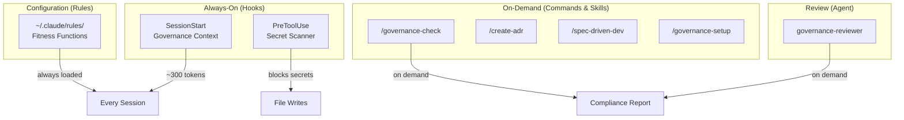
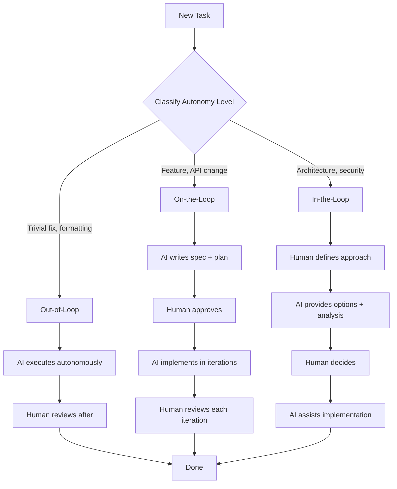
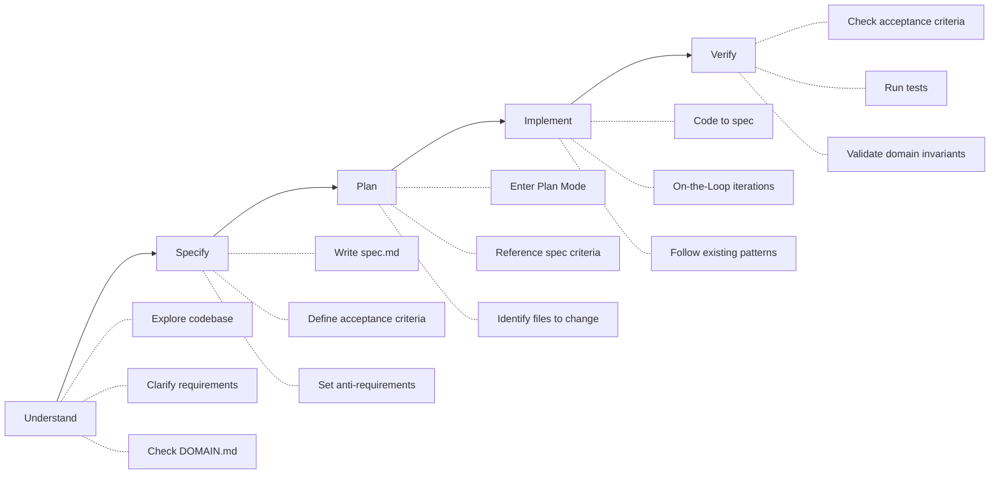

# claude-governance v2.0

**Complete governance framework for Claude Code** — shift from writing code to governing AI that writes code.

> The developer's role is evolving. Instead of writing every line, you define *what* to build, set guardrails, and let AI implement within constraints. This plugin provides the tools for that workflow.

## What's Included

| Component | Type | Description |
|-----------|------|-------------|
| **Session governance context** | Hook (SessionStart) | Injects Three Loops model + fitness functions into every session (~300 tokens) |
| **Secret scanner** | Hook (PreToolUse) | Blocks file writes containing hardcoded secrets (API keys, tokens, passwords) |
| `/governance-check` | Command | Run fitness function checks: pre-commit, pre-PR, architecture |
| `/create-adr` | Command | Generate Architecture Decision Record with governance classification |
| `/spec-driven-dev` | Skill | Specification-first development workflow |
| `/governance-setup` | Skill | Initialize governance in any project (DOMAIN.md, ADRs, rules) |
| `governance-reviewer` | Agent | Compliance review agent for code changes |
| Example rules | Templates | 5 ready-to-use rules for `~/.claude/rules/` |

## Installation

```bash
# Step 1: Add the marketplace
claude plugin marketplace add pitimon/claude-governance

# Step 2: Install the plugin
claude plugin install claude-governance@claude-governance
```

### Optional: Install Rules

Copy governance rules to `~/.claude/rules/` for always-on fitness function enforcement:

```bash
# Install all 5 rules (governance, coding-style, git-workflow, testing, security)
bash ~/.claude/plugins/marketplaces/claude-governance/scripts/install-rules.sh

# Or just the governance rule
bash ~/.claude/plugins/marketplaces/claude-governance/scripts/install-rules.sh --governance-only
```

## Core Concepts

### Three Loops Decision Model

Classify every task by the appropriate level of AI autonomy:

| Loop | AI Role | Human Role | Examples |
|------|---------|------------|----------|
| **Out-of-Loop** | Executes autonomously | Reviews after | Formatting, lint fixes, import organization |
| **On-the-Loop** | Proposes, waits for approval | Approves/rejects | New features, API changes, refactoring |
| **In-the-Loop** | Assists with options | Drives decisions | Architecture, security model, breaking changes |

### Governance Fitness Functions

"Unit tests for architecture" — automated checks at every stage:

- **Pre-commit**: No secrets, input validation, parameterized queries, file/function size limits, immutability, no console.log
- **Pre-PR**: Conventional commits, DOMAIN.md consistency, test coverage >= 80%, TODO context
- **Architecture**: Service boundaries, error message safety, auth coverage, rate limiting

### Spec-Driven Development

Developer defines WHAT + constraints. AI implements HOW within guardrails:

1. **Understand** — explore codebase, clarify requirements
2. **Specify** — write `spec.md` with requirements, constraints, acceptance criteria
3. **Plan** — generate implementation plan from spec
4. **Implement** — code in iterations with human oversight
5. **Verify** — check against acceptance criteria, run tests

## Usage

### Start a New Session

Governance context is automatically injected via the SessionStart hook. You'll see the Three Loops model and fitness function reminders in every session.

### Check Governance Compliance

```
/governance-check pre-commit    # Check staged changes
/governance-check pre-pr        # Check branch for PR readiness
/governance-check architecture  # Architecture review
/governance-check all           # Run all checks
```

### Record a Decision

```
/create-adr "Use Redis for session caching"
```

Generates `docs/adr/ADR-NNN-use-redis-for-session-caching.md` with governance classification.

### Start a Spec-Driven Feature

```
/spec-driven-dev
```

Guides you through creating a formal specification before implementation.

### Set Up Governance in a New Project

```
/governance-setup
```

Creates `DOMAIN.md`, `docs/adr/`, and optionally installs rules.

### Secret Scanner

The PreToolUse hook automatically scans file writes for hardcoded secrets. If detected, the write is **blocked** with a remediation message. Patterns detected:

- `API_KEY=`, `password=`, `PASSWORD=` with string values
- `sk-` (OpenAI/Stripe), `ghp_`/`gho_`/`ghs_` (GitHub), `AKIA` (AWS)
- `xox[bpsar]-` (Slack)

## File Structure

```
claude-governance/
├── .claude-plugin/
│   ├── plugin.json              # Plugin manifest (v2.0.0)
│   ├── marketplace.json         # Marketplace listing
│   └── hooks/
│       └── hooks.json           # Hook registrations
├── hooks/
│   ├── session-start.sh         # Inject governance context
│   └── secret-scanner.sh        # Block hardcoded secrets
├── commands/
│   ├── governance-check.md      # /governance-check command
│   └── create-adr.md            # /create-adr command
├── skills/
│   ├── spec-driven-dev/SKILL.md # /spec-driven-dev workflow
│   └── governance-setup/SKILL.md # /governance-setup wizard
├── agents/
│   └── governance-reviewer.md   # Compliance review agent
├── examples/
│   ├── DOMAIN.md.example        # Domain model template
│   ├── adr-template.md          # ADR template
│   ├── project-claude-md.example # Example CLAUDE.md with governance
│   └── rules/                   # Ready-to-use rules
│       ├── governance.md        # Fitness functions
│       ├── coding-style.md      # Code quality standards
│       ├── git-workflow.md      # Commit and PR workflow
│       ├── testing.md           # TDD and coverage requirements
│       └── security.md          # Security guidelines
├── scripts/
│   └── install-rules.sh         # Rule installer with backup
├── README.md
└── LICENSE
```

## Diagrams

### Governance Architecture



### Three Loops Decision Flow



### Spec-Driven Development Workflow



## Token Budget

| Component | Tokens | When |
|-----------|--------|------|
| SessionStart hook | ~300 | Every session (always-on) |
| Secret scanner | 0 | Runs as shell script, no token cost |
| Rules (if installed) | ~500-800 | Every session (always-on) |
| Commands, skills, agent | 0 | Only when invoked |
| **Total always-on** | **~300** | Without rules |
| **Total always-on** | **~1,100** | With rules installed |

## Research Basis

This framework draws from industry research on the evolution of the developer role:

1. **"Building Evolutionary Architectures"** — O'Reilly (Ford, Parsons, Kua): Fitness functions as automated architecture governance
2. **"The Software Developer's New Role"** — InfoQ (2024): Developers shifting from coders to system designers and AI orchestrators
3. **"Lightweight Architecture Decision Records"** — ThoughtWorks Technology Radar: ADRs for traceable architectural decisions
4. **"Spec-Driven Development"** — Industry practice derived from Design-by-Contract (Meyer, 1986)

## Contributing

Contributions welcome! Areas where help is needed:

- Additional fitness function examples for different tech stacks
- Language-specific secret patterns for the scanner
- Translations of documentation
- Real-world case studies

## License

[MIT](LICENSE)

---

Built with the conviction that the future of software development is not writing more code — it's governing AI that writes code for you.
