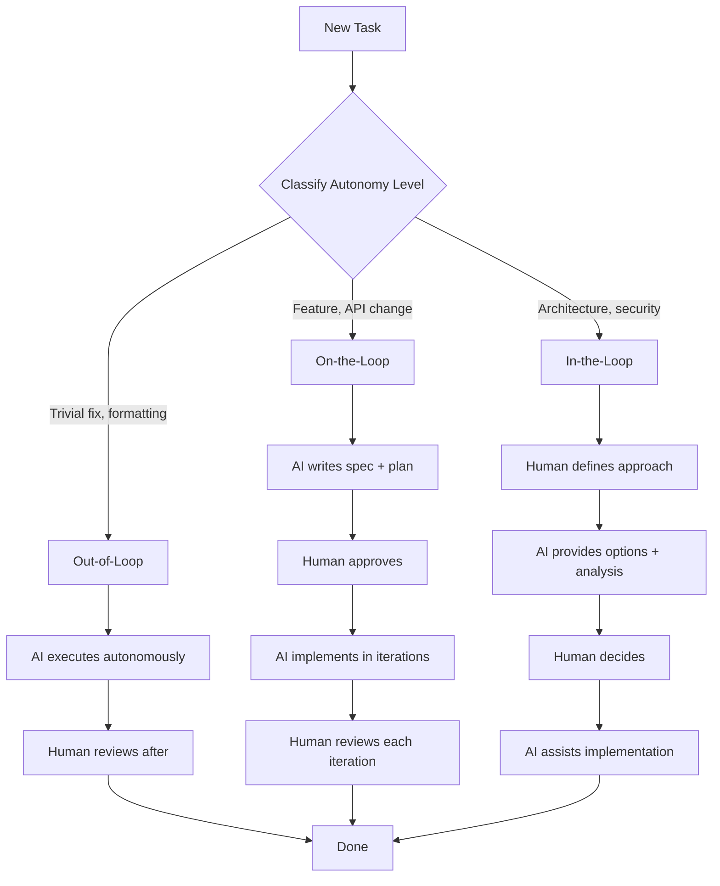
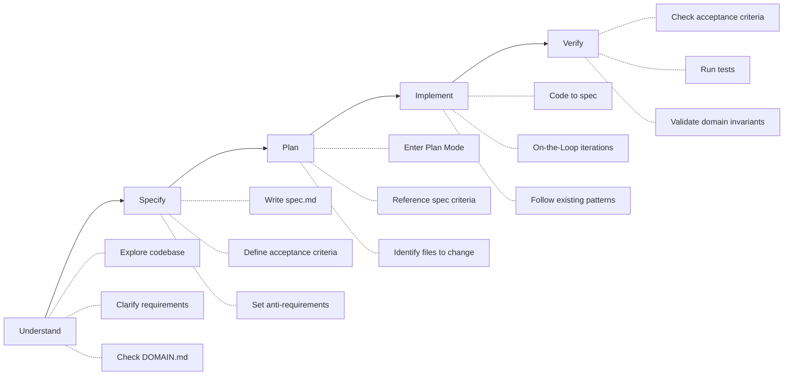
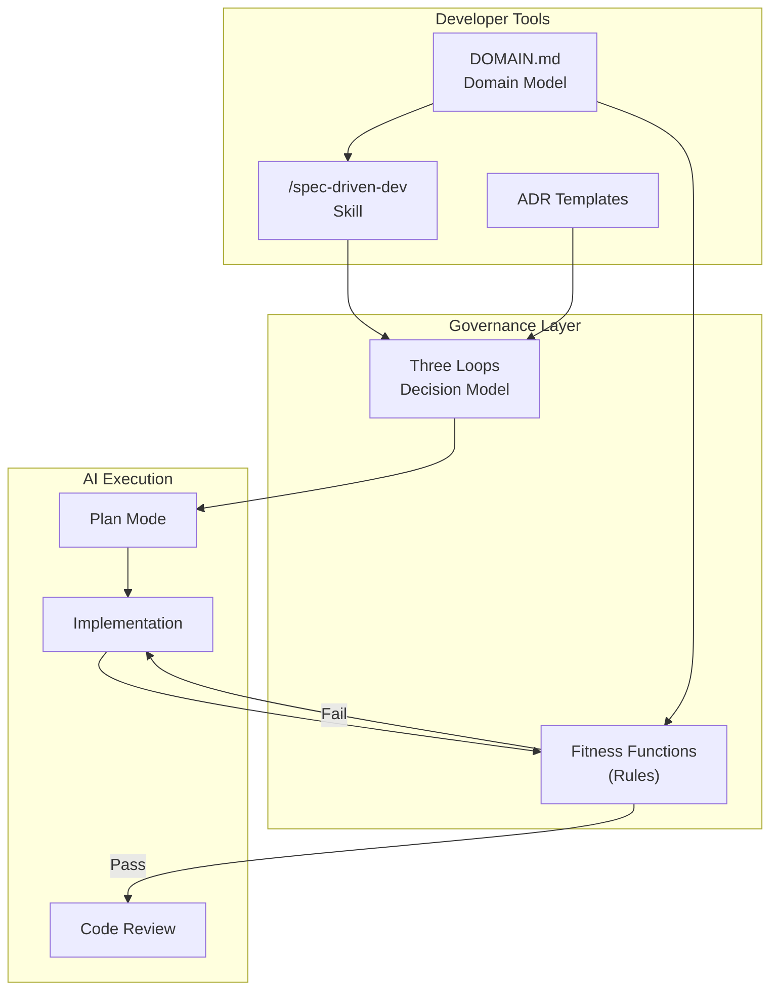
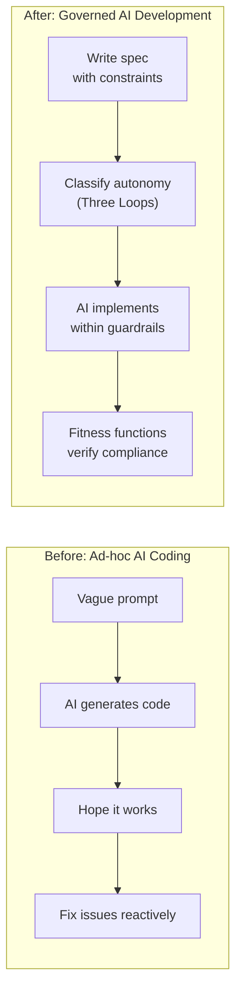

# claude-governance

**Governance skills for Claude Code** — shift from writing code to governing AI that writes code.

> The developer's role is evolving. Instead of writing every line, you define *what* to build, set guardrails, and let AI implement within constraints. This plugin provides the tools for that workflow.

## The Problem

AI coding assistants are powerful but lack structure. Without governance:
- AI makes architectural decisions without context
- Requirements live in chat messages that disappear
- No systematic way to verify AI output meets standards
- Decisions are untraceable — nobody knows *why* something was built that way

## What This Plugin Provides

### `/spec-driven-dev` — Specification-First Workflow

A slash command that guides you through creating a formal specification before implementation. You define WHAT and constraints; AI generates HOW within guardrails.

### Three Loops Decision Model

Classify every task by the appropriate level of AI autonomy:

| Loop | AI Role | Human Role | Examples |
|------|---------|------------|----------|
| **Out-of-Loop** | Executes autonomously | Reviews after | Formatting, lint fixes, import organization |
| **On-the-Loop** | Proposes, waits for approval | Approves/rejects | New features, API changes, refactoring |
| **In-the-Loop** | Assists with options | Drives decisions | Architecture, security model, breaking changes |

### Governance Fitness Functions

"Unit tests for architecture" — automated checks at every stage:

- **Pre-implementation**: Spec exists? Domain impact assessed? Autonomy level classified?
- **Pre-commit**: No secrets? Input validated? Files under 800 lines?
- **Pre-PR**: Conventional commits? Tests at 80%+? Breaking changes documented?
- **Architecture**: Service boundaries? Rate limiting? Auth on all endpoints?

### Architecture Decision Records (ADRs)

Lightweight templates for recording *why* decisions were made, with governance classification:

```markdown
# ADR-001: [Decision Title]
## Status: Accepted
## Context: What motivated this decision?
## Decision: What did we decide?
## Consequences: What trade-offs?
## Governance:
- Decision Loop: On-the-Loop
- Fitness Function: How to verify compliance
```

## Diagrams

### Three Loops Decision Flow



### Spec-Driven Development Workflow



### Governance Architecture Overview



### Before vs After



## Installation

```bash
claude plugin marketplace add pitimon/claude-governance
```

## Usage

### Start a Spec-Driven Feature

```
You: /spec-driven-dev

Claude: Starting spec-driven development workflow...
        1. Understand — exploring codebase...
        2. Specify — let's write a spec.md
        ...
```

### Set Up Governance in Your Project

1. **Copy the domain model template** to your project root:
   ```bash
   cp examples/DOMAIN.md.example ./DOMAIN.md
   ```
   Edit it to define your project's entities, invariants, and API contracts.

2. **Add the governance rule** to your Claude Code rules:
   ```bash
   cp examples/governance-rule.md ~/.claude/rules/governance.md
   ```
   This adds fitness function checks to your development workflow.

3. **Set up ADR tracking** in your project:
   ```bash
   mkdir -p docs/adr
   cp examples/adr-template.md docs/adr/template.md
   ```
   Record architectural decisions with governance classification.

### The Spec Template

When you run `/spec-driven-dev`, it guides you through creating a spec with:

- **Requirements** (MUST vs SHOULD) — prioritized, testable
- **Domain Impact** — which entities change, new invariants
- **Constraints** — anti-requirements (what NOT to do), patterns to follow
- **Acceptance Criteria** — Given/When/Then format
- **Verification Plan** — unit, integration, E2E test strategy

## Companion Templates

The `examples/` directory contains templates you can copy into any project:

| Template | Purpose | Copy to |
|----------|---------|---------|
| `DOMAIN.md.example` | Domain model with entities, invariants, API contracts | `./DOMAIN.md` |
| `governance-rule.md` | Fitness functions for pre-commit/pre-PR checks | `~/.claude/rules/governance.md` |
| `adr-template.md` | Architecture Decision Record with governance loop | `./docs/adr/template.md` |

## Before vs After

| Aspect | Without Governance | With Governance |
|--------|-------------------|-----------------|
| **Requirements** | Verbal/chat-based, disappear | Formal spec.md, version-controlled |
| **AI Autonomy** | Unclassified — AI decides everything | Three Loops — right level per task |
| **Quality Checks** | Manual review only | Automated fitness functions |
| **Decisions** | Untraceable | ADRs with rationale + governance loop |
| **Domain Knowledge** | Implicit, lost between sessions | Explicit DOMAIN.md with invariants |
| **Anti-requirements** | Not defined | Explicit constraints on what NOT to do |
| **Verification** | Ad-hoc testing | Structured acceptance criteria |

## Research Basis

This framework draws from industry research on the evolution of the developer role in the age of AI:

1. **"The Software Developer's New Role"** — InfoQ (2024): Developers shifting from coders to system designers and AI orchestrators
2. **"Building Evolutionary Architectures"** — O'Reilly (Ford, Parsons, Kua): Fitness functions as automated architecture governance
3. **"How AI is Changing Software Development"** — GitHub Blog (2024): AI pair programming and the changing nature of code review
4. **"The Future of Jobs Report"** — World Economic Forum (2024): AI augmentation requiring new governance skills
5. **"Lightweight Architecture Decision Records"** — ThoughtWorks Technology Radar: ADRs for traceable architectural decisions
6. **"Spec-Driven Development"** — Industry practice: Specification as single source of truth, derived from Design-by-Contract (Meyer, 1986)

## Contributing

Contributions welcome! Areas where help is needed:

- Additional skill templates (e.g., `/adr-create`, `/governance-check`)
- More fitness function examples for different tech stacks
- Translations of documentation
- Real-world case studies

## License

[MIT](LICENSE)

---

Built with the conviction that the future of software development is not writing more code — it's governing AI that writes code for you.
